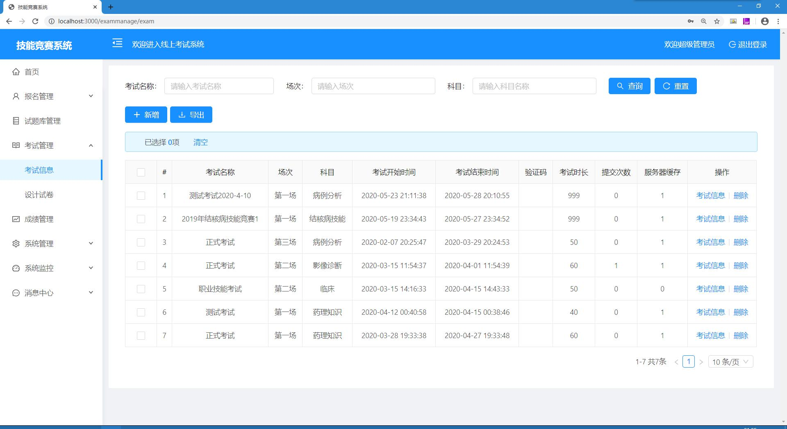

# Online Exam System
An Online Exam System with high security based on the framework of SpringBoot and Vue.js to host online exams with high concurrency. 


## Table of Contents
* [Introduction](#introduction)
* [Technologies](#technologies)
* [Functionalities](#functionalities)
* [Launch](#launch)
* [Examples](#examples)

## Introduction 
In the time of pandemic, online learing is getting more and more popular, at the meantime, online exam is an unavoidable choice. This online exam system comes with high security and capability to handle high concurrency request. It provides plenty of specialized features such as exam paper auto judgement, generate exam result analysis and so on, which makes it more convenient to organize online exams.

## Technologies
* For the frontend, we use Vue.js, Ant Desgin of Vue.

* For backend, we choose SpringBoot framework, Shiro Security framework to do authentication and role verification, and Redis data store to deal with high concurrency.

* For database, MYSQL is chosen, and we use Druid as Connection Pool, Mybatis is as the persistence framework.

* When testing, we use Junit and Swagger-ui.

## Functionalities
### Our application are used by 4 roles:
* Examinee: They are allowed to access their exam papers, answer exam questions, and submit their exam papers.

* Exam Paper Desginer: They are allowed to design questions for exams, and access the question repository.

* Exam Organizer: They are allowed to set the exam name, exam time window, exam time limit, and other information about exams. Besides, they can also check the exam results and its analysis.

* Administrator: They are given the authorization to manage examinees' personal information, and control the permission of those roles.


## Launch
### 1. Prepare Database
You need to run the db.sql in the repository to generate the database table structures. Change the database username and password to your owns in application-dev.yml

### 2. Start Redis
Install and start redis-server.exe

### 3. Run Backend
Open folder named "ik-analyzer", and run this tiny project using this command to install ik-analyzer to your local maven repo:
```
mvn install -Dmaven.test.skip=true
```
And next, import the folder "jeecg-boot" as Maven project, compile and run this project, the backend will be started at localhost: 8081, you can change port at application-dev.yml

### 4. Run Frontend
Remove node_modules and package-lock.json under ant-design-jeecg-vue if existed, and run the following commands at root directory (remember to install Node.js and npm at first) sequentially:
```
npm install
```
```
npm run serve
```
The application frontend will be running at localhost:3000, and all request will be transferred to port 8081 where the backend is.

## Examples
### Here are some examples when running the system as an superadmin:
### 1. Homepage


### 2. Exam page when examinee accesses the paper


### 3. Examinee information page


### 4. Question repository outter page


### 5. Question repository inner page


### 6. Exam manage page


### 7. Design paper page


### 8. Submit records of examineese


### 9. Exam scores


### 10. Exam result analysis page


### Pages and functions will be more clear when you run this application.